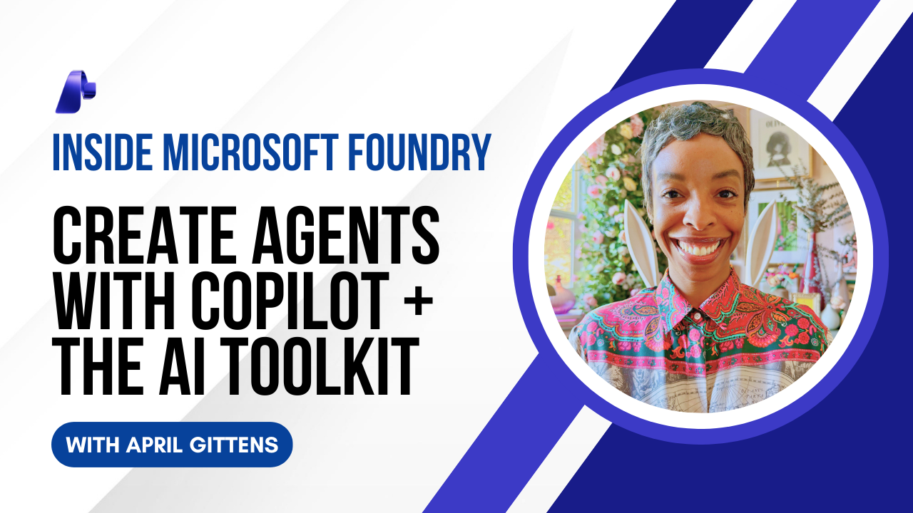

# AI Toolkit & Copilot

Learn how to create an agent with the AI Toolkit & Copilot in this 6-part series.

- AI Toolkit + Copilot - Pt. 1:  Environment Setup
- AI Toolkit + Copilot - Pt. 2:  Model Recommendations
- AI Toolkit + Copilot - Pt. 3:  Create an Agent with Tools
- AI Toolkit + Copilot - Pt. 4:  Generate Agent Code
- AI Toolkit + Copilot - Pt. 5:  Add Tracing to an Agent
- AI Toolkit + Copilot - Pt. 6:  Evaluate Agent Output

This video series is part of the Copilot + AI Toolkit Pet Planner workshop. View the repo and instructions: [aka.ms/AIToolkit/workshop](https://aka.ms/AIToolkit/workshop)

## Prerequisites

- A [Microsoft Foundry](https://ai.azure.com) project
- Access to [GitHub Copilot](https://github.com/features/copilot) and one of the following models:
    - GPT-5 mini
    - Claude Haiku 4.5
    - Claude Opus 4.1
    - Claude Opus 4.5
    - Claude Sonnet 4
    - Claude Sonnet 4.5