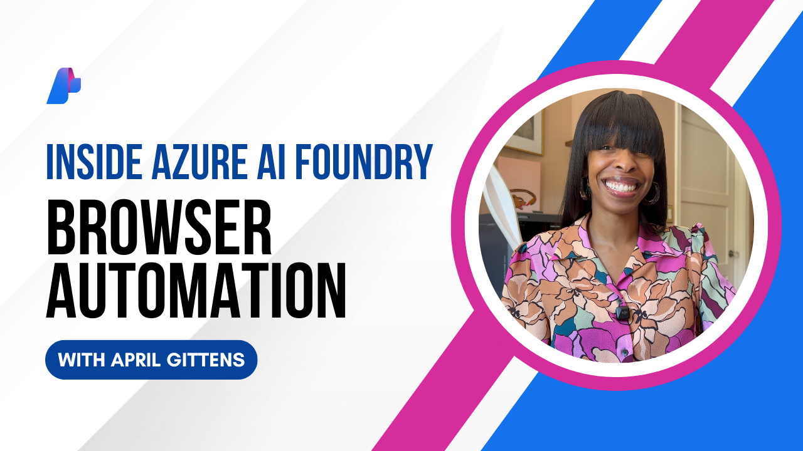

# Browser Automation

See the Browser Automation Tool (Preview) in Azure AI Foundry in action! In this episode, April demonstrates how you can give a natural language request to an agent and watch as the agent executes browser tasks on your behalf. Powered by Playwright Workspaces running in your Azure subscription, each session is fully isolated and secure. The model inspects the page’s structure, decides what actions to take, and executes them step-by-step, adjusting along the way until the task is complete.

Try it out today in Azure AI Foundry and see what you can automate: [ai.azure.com](https://ai.azure.com)

Learn more about the Browser Automation Tool (Preview): [aka.ms/insideAIF/browser-automation](https://aka.ms/insideAIF/browser-automation)

## Prerequisites

- An Azure account with an active subscription. If you don't have an Azure subscription, create a [free account](https://azure.microsoft.com/free/) before you begin.
- Your Azure account needs the [Owner](https://learn.microsoft.com/azure/role-based-access-control/built-in-roles#owner), [Contributor](https://learn.microsoft.com/azure/role-based-access-control/built-in-roles#contributor), or one of the [classic administrator roles](https://learn.microsoft.com/azure/role-based-access-control/rbac-and-directory-admin-roles#classic-subscription-administrator-roles).
- [Azure CLI](https://learn.microsoft.com/cli/azure/install-azure-cli?view=azure-cli-latest) installed
- An [Azure AI Foundry](https://ai.azure.com) project
- An Azure AI Foundry "agent supported" model deployment.
- A [Playwright Workspace](https://learn.microsoft.com/azure/app-testing/playwright-workspaces/how-to-manage-playwright-workspace) resource

*Note: Only **agent supported** models can be used with the Browser Automation tool. You can filter to **Agent supported** models in the **Model Catalog** via the **Capabilities** filter.*

## Connect Playwright Workspace to Azure AI Foundry
1. Generate an [Access Token](https://learn.microsoft.com/azure/app-testing/playwright-workspaces/how-to-manage-access-tokens) for your Playwright Workspace resource and copy the token somewhere that you can later access.
1. In the [Azure AI Foundry](https://ai.azure.com) portal, open your project.
1. Navigate to **Management Center** > **Connected Resources**.
1. Create a new connection.
1. Search for **Serverless Model** and select the **Serverless Model** connection type.
1. Enter the following:
    - **Target URI**: Your Playwright Workspace Region (e.g., The **Browser endpoint** which is available in the Azure portal on the **Overview** page for your Playwright Workspace resource. It starts with **wss://...**.)
    - **Key**: Your Playwright Workspace Access Token

## Run the Sample

1. Navigate to the folder: `cd Samples/Browser-Automation-Tool`
1. Install dependencies: `pip install -r requirements.txt`
1. Set up environment variables: `copy .env.example .env`
1. Authenticate to Azure using Azure CLI: `az login`
1. Run the script: `python browser-automation.py`